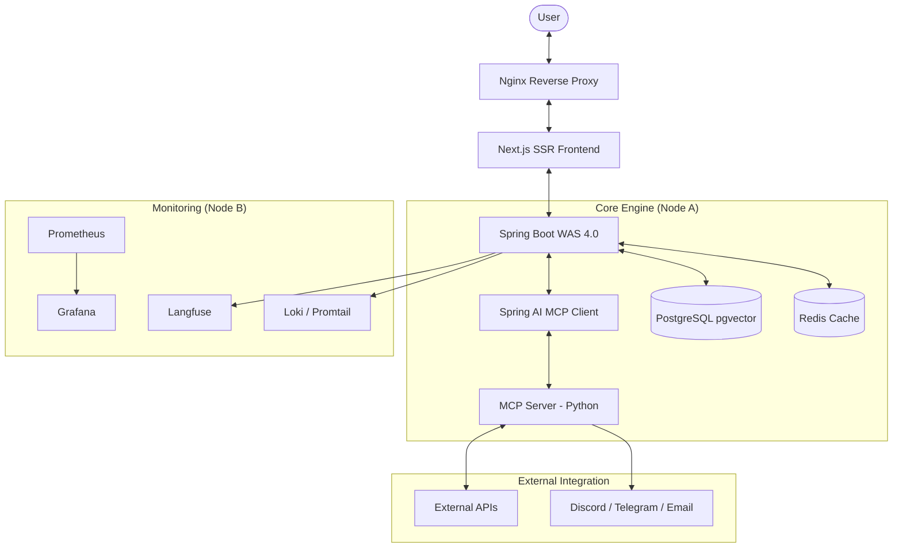

# 🔔 지켜봐줄게 
**관심사 변화를 AI 브리핑으로 알려주는 지능형 알림 서비스**

사용자가 일상 언어로 조건을 설정하면, AI가 이를 구조화하여 모니터링하고 관심사의 변화를 실시간으로 브리핑해주는 플랫폼입니다

---

## 💡 프로젝트 개요
* **배경**: 부동산 가격, 채용 공고 등 관심 정보를 반복 확인하는 현대인의 탐색 비용을 절감하기 위해 기획되었습니다.
* **목표**: 일상 언어로 말하면 AI가 알아서 모니터링하고 알려주는 지능형 알림 플랫폼 실현.
* **핵심 가치**:
    * **자연어 인터페이스**: 복잡한 규칙 없이 일상 언어로 조건 설정 가능.
    * **멀티 도메인**: 부동산 • 법률 • 채용 • 경매 등의 영역 지원.
    * **토큰 기반 관리**: 리소스 사용량을 토큰으로 운영.

---

## 🏗 시스템 아키텍처 (Architecture)

*다이어그램 기반 정보*

---

## 🔄 주요 프로세스 (Flow)

### 1. 챗봇 실시간 검색 (Phase 1-A)
* 사용자 입력이 들어오면 Chat API와 Fetch Tool을 통해 실시간 데이터를 검색하여 응답을 생성합니다.

### 2. 사용자 구독 등록 (Phase 1-B)
* 사용자의 자연어 요청을 구조화하여 구독 모니터링 조건(도메인, 쿼리, 실행 주기 등)으로 DB에 저장합니다.

### 3. 동적 구독 모니터링 (Phase 2)
* 스케줄러가 주기적으로 실행되어 MCP를 통해 데이터를 수집하고, 변화 감지 AI가 스냅샷을 비교하여 알림을 발송합니다.

---

## 🚀 결과 및 회고
* **성과**: 복잡한 계층 구현 대신 도구 설명만으로 기능을 확장하는 유연한 구조를 실현했습니다.
